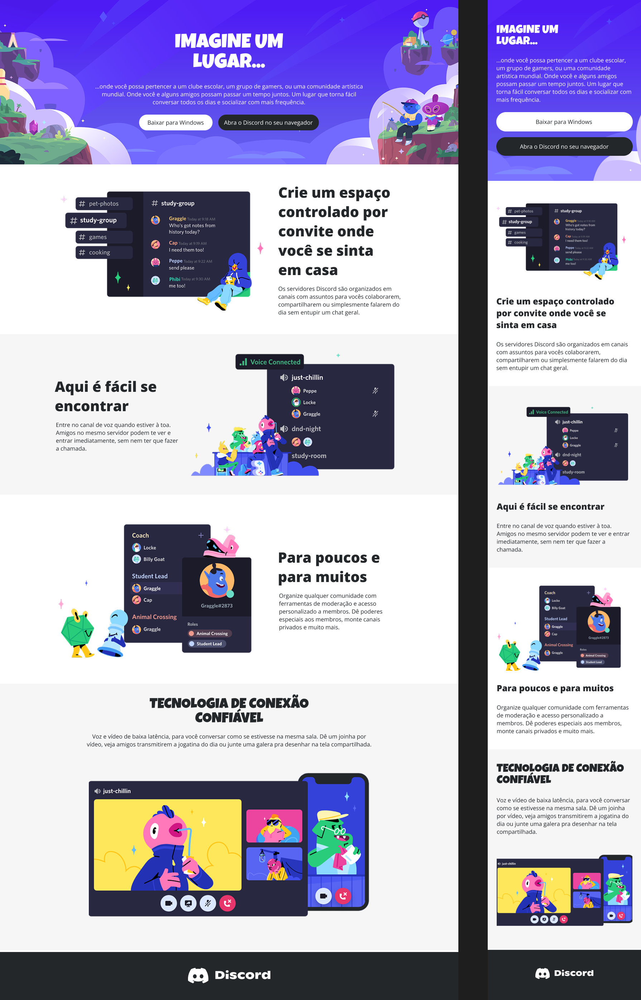

# Reproduzindo a Página do Discord – Desafio Front End

## Descrição do Projeto
Este projeto consiste na reprodução da página inicial da plataforma **Discord**, utilizando HTML e CSS. O principal objetivo do desafio é aplicar conceitos de **responsividade**, garantindo que a página se adapte a diferentes tamanhos de tela, desde desktops até dispositivos móveis.

## Preview do Projeto


Link deploy: https://trilha-css-desafio-03-discord-respo.vercel.app/

O layout inclui:
- **Header** com imagem de fundo, título e botões de ação.
- **Seções de conteúdo** com textos e imagens, organizadas lado a lado em desktops e empilhadas em dispositivos móveis.
- **Footer** com imagem representativa da plataforma.

O projeto foi desenvolvido com foco em:
- Estrutura semântica em HTML.
- Flexbox e `gap` para posicionamento dos elementos.
- Tipografia personalizada usando fontes **Luckiest Guy** e **Open Sans**.
- Ajustes de responsividade via media queries.

## Tecnologias Utilizadas
- HTML5
- CSS3
- Google Fonts: Luckiest Guy e Open Sans

## Como Executar
1. Clone o repositório:
```bash
git clone https://github.com/seu-usuario/nome-do-repositorio.git
